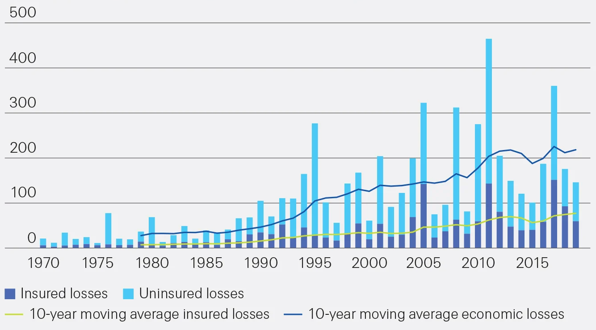

I'm a Data scientist, working at the scale-up Descartes Underwriting.

Earlier, I've been a student in Computer science at Ecole Polytechnique ⚔️ and I graduated in 2021 from University of Cambridge 👨‍🎓. See my [Curriculum Vitae](CV_AymericRoucher_03-22.pdf) for greater detail.

### Descartes

[Descartes](https://www.descartesunderwriting.com/) is a fast-growing french Insurtech, providing insurance against climate risks (cyclones, frost, wildfires...) to a global set of clients.

Climate change would be better named Climate disruption: it causes a sharp increase in weather-related catastrophes. As a result, insured losses are growing, non-insured losses are exploding. We're here to fill the coverage gap. 

The company provides [parametric insurance](https://corporatesolutions.swissre.com/insights/knowledge/what_is_parametric_insurance.html), a new kind of insurance in which the payment following an event is not subject an expert's validation, but automatically triggered according to a predefined weather index. It could be for instance : "If a cyclone's eye comes closer than 50km from your GPS coordinates, we pay." This process ensures fast and hassle-free payments for the client, and easier risk calculation for the company - thus lower prices.

The company is growing fast : when I joined in September 2021, we were only 30 FTEs, now we're coming close to 100.

### My job there

I joined the company to prototype and launch new  products. Each product requires a vast set of competencies, and heavily relies on a data, from the sourcing of weather data from a third-party, to the risk calculations based on historical events and stochastic models.

This means I constantly keep watching for new evolutions of the climate risks all over the globe, which is a worryisome, but truly captivating subject.

